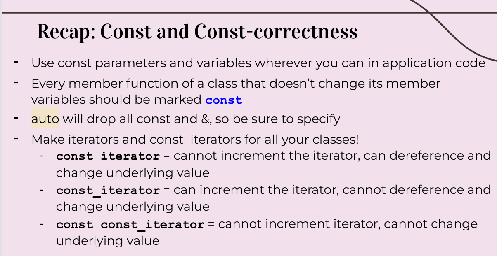
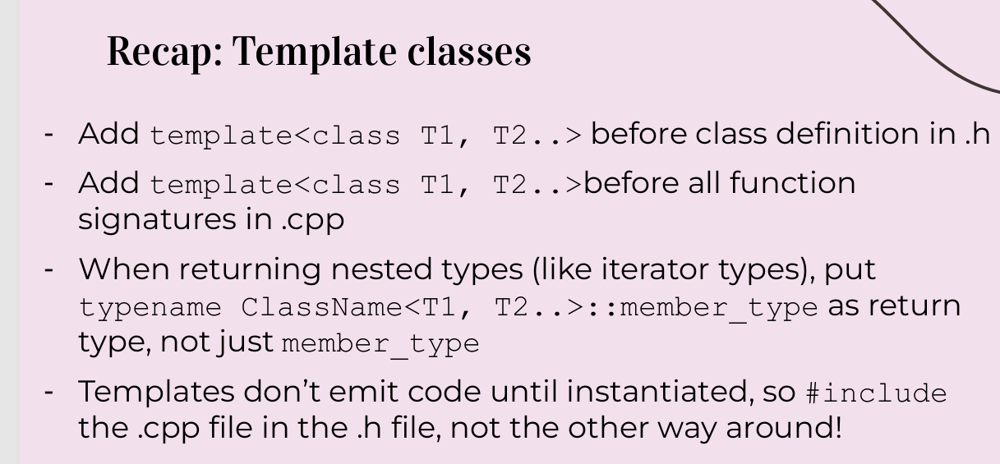
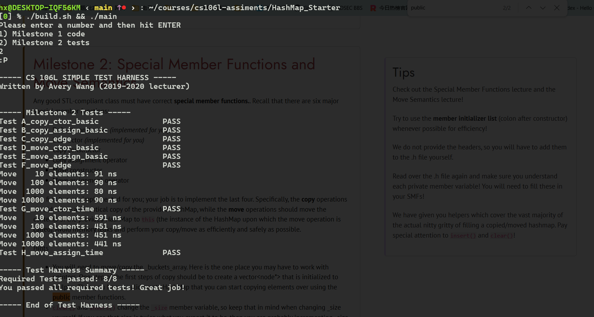

# Assignment 2: STL HashMap

### Introduction and Assignment Goals

根据资深c++程序员的说法，有两个项目将带来一个资深程序员应该有的所有知识：

1. 实现一个 STL标准的模版函数 和 
2. 实现一个宏在编译时将字符串散列。

在这个任务中，我们将通过实现stl标准的hashmap把#1 放入你的简历中。

回忆： Map 抽象类型存储 key->value pair, 并且提供高效的搜索来查找所有值的键。

有两个版本在STL中：`std::map`,传统上采用平衡二叉树；`std::unordered_map`，使用散列值，支持大多数map操作在非常快速的时间。

在这个任务中，你将完整实现一个HashMap。启动代码是几乎完整的，但不是 STL-标准的。例如，copy和move 语法是不支持的。你的任务是将其扩展为一个stl-标准的，工业 强度，鲁棒性并且非常快的数据结构。

hashmap是一个有一点复杂的数据结构，但是我们给予你几乎所有的实现。简而言之，这是它工作的原理：

- 一个hashmap 存储一个"buckets(桶)"数组（vector `_buckets_array`)

- 每个bucket 是一个链表： 链表由node组成，node定义在 hashmap.h 中。
- 在这些链表中每个node存储一个键值对。在node结构中，value 的类型是 `value_tye`。`value_type`是 `std::pair<K,M>` 的别名。在.h文件的顶部。
- 当一个hashmap的用户想查找或者插入一个键，HashMap 类首先转化这个键为整数，无论它的类型是什么。它通过hash函数完成这点，hash函数存储在成员私有变量 _hash_function。为了我们的目标，这会是STL中的默认哈希函数.然后，HashMap类把数字用bucket数量取模。这将是键将插入或寻找的索引。然后，遍历链表找到键。（一索引有可能有多个键，因为哈希值可能相同，也可能是哈希值取模后相同。）
- HashMap 可能偶然增加桶的数量然后再次哈希，来保证每个索引没有存储太多的键。这保证所有操作非常快，因为查找数组非常快并且我们保证链表非常短。

我们强烈建议你将代码看完并且理解发生了什么。但是这个任务不会叫你实现任何东西除了 SMF。这些SMF只用来初始化私有成员变量。

**你将不用写很多的代码**(~20 行),但你需要花时间理解启动代码，并对设计选择和常用C++习惯做推断。

可以选择一个合作者。

### Download And Set Up Assignment

1. 下载 启动代码： https://web.stanford.edu/class/cs106l/assignments/HashMap_Starter.zip

2.  `unzip HashMap_Starter.zip`

### Starter Code

- `hashmap.h`: 这个文件包含了HashMap中的(不完整)类函数原型，并且包括注释。**你将在milestone 1 中修改许多函数原型 ，并在 milestone 2中增加一些**。你也许可以增加一些私有的有用的函数(虽然你可能不需要做),但不要增加或者修改任何公开函数的原型。如果把size写成lenth，或者把erase函数带了几个额外的参数等等将会是灾难性的。

- `hashmap.cpp`：这个文件包括了HashMap 的实现，并且包括了实现细节的注释。**另外改变了milestone1 中的声明，你将需要在milestone 2添加实现到这个文件**

- `hashmap_iterator.h`：这个文件包含了HashMapIterator完整的类声明和实现,也包含了关于每个函数的注释。你将在milestone 1阅读这些代码，但是你不需要修改。**我们从来没有使用一个类作为迭代器类型，保证你阅读了这些文件，并尽力理解发生了什么。**重要地，检查 `hashmap.h` 中 `iterator`  和 `const_iterator`的 不同点。
- short_answer.txt: 回答问题
- build.sh : 编译指令。
- main.cpp: 用于HashMap 的样例。
- tests.cpp 和 test_settings.cpp: 包括许多数量的代码来验证hashmap.

### Milestone 1: Const-Correctness

给HashMap类写**常量接口** 。 回忆我们经常标记变量 为const，尤其是函数变量  ,来避免一种特别的bug： 修改了我们不想修改的数据。 **强烈建议 在开始之前回顾 一下Template Classes and Const-Correctness 的演讲的结尾**。

查看这两页ppt





我们已将一堆成员函数标记好给你了(查看begin的const重载)。完成miestone1 需要做的事：

从这里开始要阅读代码了。

1.  `main.cpp`文件中的helper函数，能加const的参数，全加上。
2. 给尽量能添加const的函数，添加const,先加上，后面可能还要去掉。
3. 需要添加一些函数增强鲁棒性。给一些函数添加返回const_iteraor的版本，因为有时不需要修改这些迭代器,比如对象是一个常量的。
   - hint1： 使用static_cast将非常量转化为常量，使用const_cast 将 常量转化为非常量。
   - hint2: 看下哪些返回 `iterator`的函数有必要返回一个 `const_iterator`
   - hint3: 如果 `main.cpp`中的const正确标记，那么任何非常量的函数都会报错，可以利用这个作为指导需要重载哪些函数 还有一个不返回迭代器的函数需要重载。
     这个函数是at

4. Finally, uncomment lines 5, 6, and 28 (the ones with the comment "UNCOMMENT FOR MILESTONE 2"), and try to compile again. If you missed any functions that needed to be marked const or overloaded, you will see that calls to those functions error in the compiler error messages!

这部分代码就不粘贴了。

#### Writeup

Please answer these questions in `short_answer.txt`

1. at() vs []

   Explain the difference between `at()` and the implementation of the operator `[]`. Wy did you have to overload one and not the other?
   *Hint: You will likely only need to read the header comments to do this*
   **ans:** 

   Because when [] doesn't find a key ,it will create a K/M pair for the key with a default mapped value.So we can't mark [] with const。

2. Find vs. 𝓕𝓲𝓷𝓭

   In addition to the `HashMap::find` member function, there is also a `std::find` function in the STL algorithms library. If you were searching for key k in HashMap m, is it preferable to call `m.find(k)` or `std::find(m.begin(), m.end(), k)`?
   *Hint: on average, there are a constant number of elements per bucket. Also, one of these functions has a faster Big-O complexity because one of them uses a loop while another does something smarter.*

   **ans**: the average complexity of m.find(k)  is O(1),however the average complexity of std::find(m.begin(), m.end(), k) is O(n). So it is preferable to call m.find(k).

3. RAII?
   This HashMap class is RAII-compliant. Explain why.
   **ans**: 
   Here is its two rules:

   - All resources used by a class should be acquired in the constructor

   - All resources used by a class should be released in the  destructor

   Bucket pointers and size  are acquired in the constructor as well as released in the destructor。We don't need release by hand。

   但是只有insert有new，没有其他地方有delete，不知道为啥是RAII。
   
4. Increments

   Briefly explain the implementation of HashMapIterator's operator++, which we provide for you. How does it work and what checks does it have?
   **ans**:

   ```c++
   template <typename Map, bool IsConst>
   HashMapIterator<Map, IsConst>& HashMapIterator<Map, IsConst>::operator++() {
       _node = _node->next; // _node can't be nullptr - that would be incrementing end()
       if (_node == nullptr) { // if you reach the end of the bucket, find the next bucket
           for (++_bucket; _bucket < _buckets_array->size(); ++_bucket) {
               _node = (*_buckets_array)[_bucket];
               if (_node != nullptr) {
                   return *this;
               }
           }
       }
       return *this;
   }
   ```

   Firstly, ++ assign _node to _node->next。Secondly, ++ checks out if _node is nullptr。if it's not null, it will return this which is current Iterator。Otherwise,it will checkout the next bucket until there is not a nullptr。

​	

### Milestone 2: Special Member Functions and Move Semantics

任何优秀的STL标准类一定要有正确的 SMFs。它们是：

- Default constructor *(implemented for you)*
- Destructor *(implemented for you)*
- Copy constructor
- Copy assignment operator
- Move constructor
- Move assignment operator

你的任务是实现剩下四个。特别地，复制操作应该创建一个与提供HashMap 相同的副本。move 操作应该 移动 提供HashMap 的内容到this。避免内存泄漏并且copy/move执行得越高效、安全越好。

提示：

- 你需要移动或者复制 the `_buckets_array`。这是一个需要和指针打交道的地方。 复制开始中的一步应该是创建一个 `vector<node*>` 初始化为 nullptr。 然后，你有个正确的空HashMap，可以通过公开成员函数往里复制元素。
- `clear()` 和 `insert()` 改变 `-size`成员变量，所以小心这些当你改变自己改变size时。如果你看到size是你想要的两倍大小，那么你可能增加了两次_size ： 一次在 insert(),一次在你自己的代码里。
- 自己赋值要小心。 提示：使用insert和 clear
- 在边界案例测试中，你可能看到 链式赋值（例如：`map = map = map`）。这个 赋值操作是右关联的，所以返回HashMap 的引用， 解释为：`map = (map = map)`。你不用担心这个——只要smfs头是正确的并且你闭麦呢了自己赋值，这个情况会被自动解决。
- 记住，你可以使用迭代器和插入成员函数。

#### Tips

Check out the Special Member Functions lecture and the Move Semantics lecture!

Try to use the **member initializer list** (colon after constructor) whenever possible for efficiency!

We do not provide the headers, so you will have to add them to the .h file yourself.

Read over the .h file again and make sure you understand each private member variable! You will need to fill these in your SMFs!

We have given you helpers which cover the vast majority of the actual nitty gritty of filling a copied/moved hashmap. Pay special attention to `insert()` and `clear()`! 

我们已经提供了帮助程序，它们涵盖了填充复制/移动的散列表的绝大多数实际细节。特别注意插入()和清除() ！

实现过程中遇到一个bug，非常难检查出来，因为这个bug是在上一部分遗留下来的。

我把end实现写成了：

```c++
template <typename K, typename M, typename H>
typename HashMap<K, M, H>::const_iterator HashMap<K, M, H>::end() const {
	return static_cast<const_iterator>(const_cast<HashMap<K, M, H>*>(this)->begin());
}

```

后面在拷贝构造的循环中打印的时候发现循环根本进不去，才去检查了begin和end函数。

运行结果



#### Writeup

1. Attachment Issues

   Why is it that we need to implement the special member functions in the HashMap class, but we can default all the special member functions in the HashMapIterator class?
   *Hint: your answer should reference the Rule of Five (the Rule of 3 including move operations) vs. the Rule of Zero, and also talk about std::vector's copy constructor/assignment operator.*
   因为含有HashMap 类含有指针 而HashMapiterator 不含有指针。含有指针的一般涉及深层复制，而这里确实也需要深层复制。所以需要自己定义

   The rule of Five : 重新定义析构、拷贝构造、拷贝赋值、移动构造，移动赋值中某一个时，需要重新定义所有。

   The rule of 0 ： 当原始smf起作用时，不要定义自己的smfs

   vector 的默认拷贝构造函数是浅层复制，所以当存储指针这种类型，需要重定义拷贝构造函数。

2. Move Semantics
   In your move constructor or move assignment operator, why did you have to std::move each member, even though the parameter (named rhs) is already an r-value reference?
   说明 rhs此时已经是左值，因为有了名字，作用域是整个函数。 所以需要使用std::move 来将每个成员变为右值。